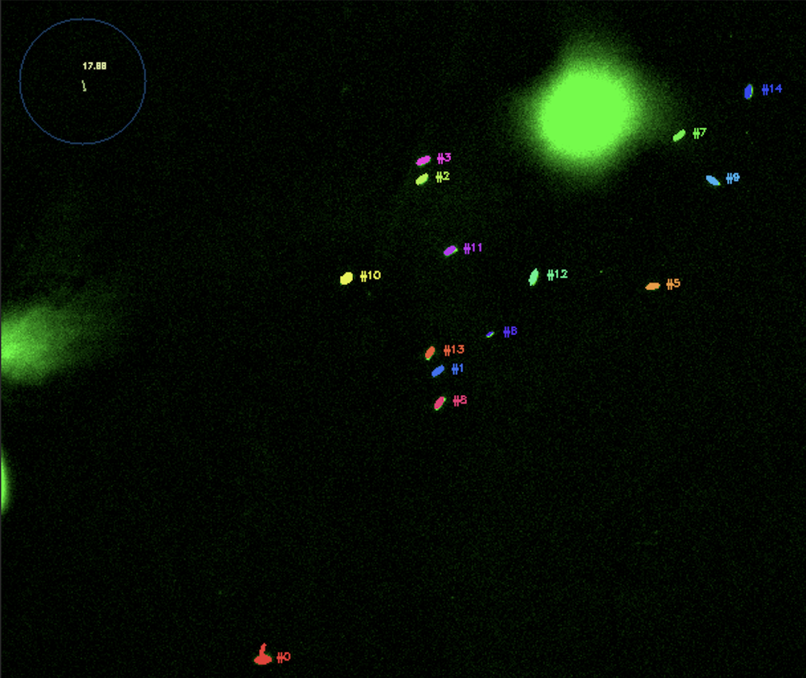
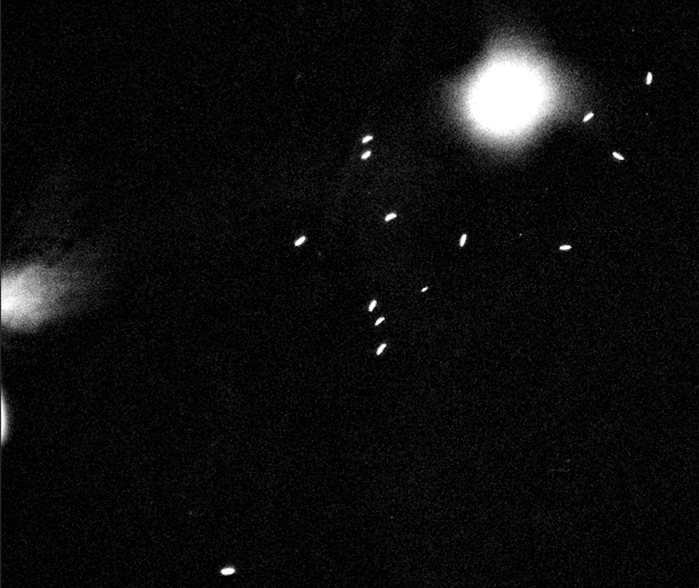
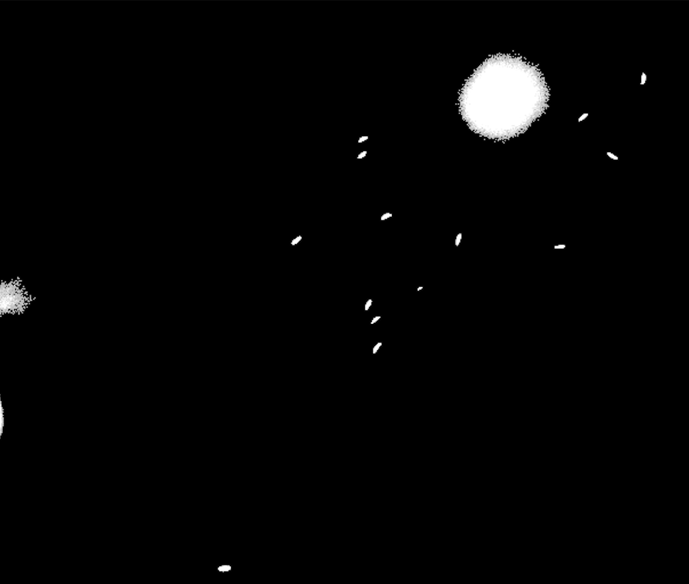
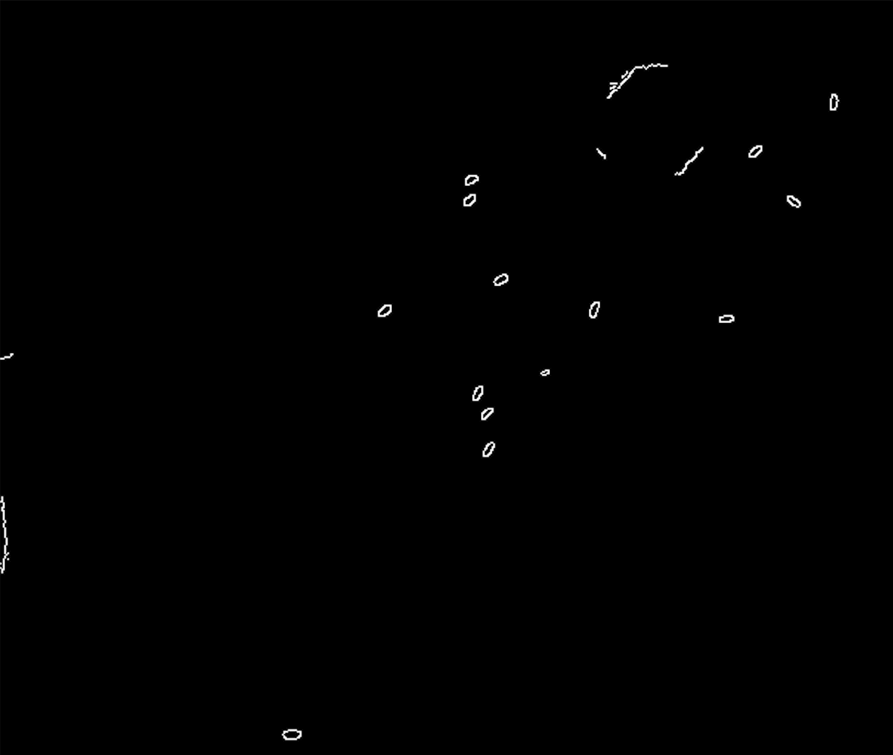
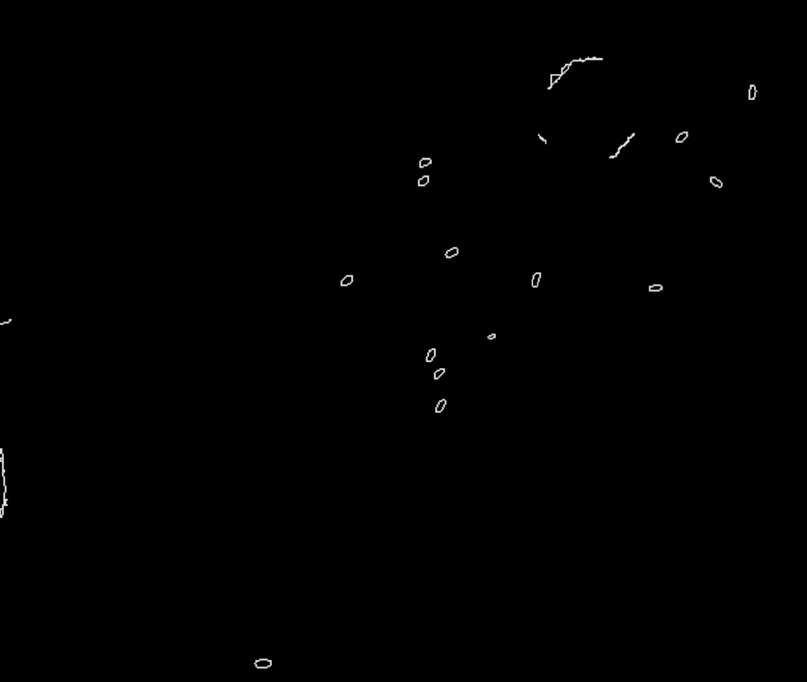
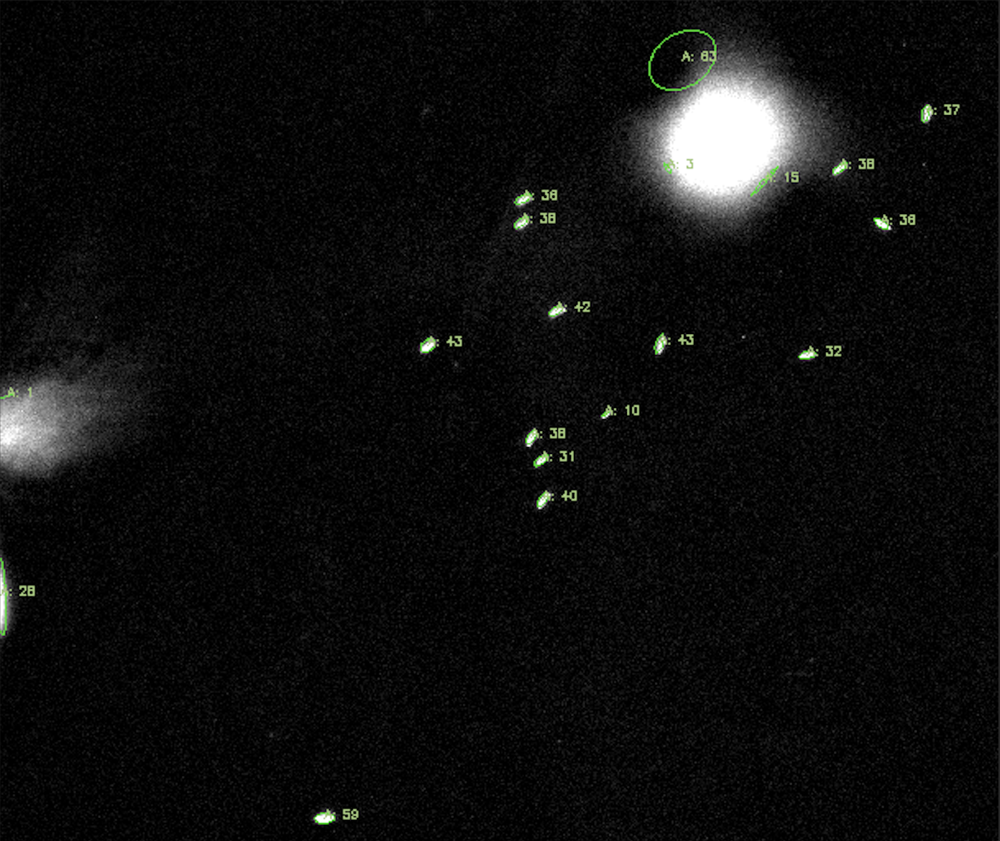

# SPOROTRACKER

Analyze microscopy imagery to detect and track elliptical bodies such as sporozoites.


## Installation

1. Clone the repository:
   ```bash
   git clone https://github.com/username/sporotracker.git
   ```

2. Navigate to the project directory:
   ```bash
   cd sporotracker
   ```

3. Run the setup script:
   - **Mac/Linux**: `./setup.sh`
   - **Windows**: `./setup.bat`

4. Launch the program:
   ```bash
   uv run main.py
   ```

## Frame Processing Pipeline

1. **Image Normalization**
   - Standardizes 8-bit frame values to the 0-255 pixel range
   - Ensures consistent brightness and contrast across frames

2. **Histogram Equalization**
   - Enhances contrast of high-intensity regions

3. **Threshold Masking** *(optional)*
   - Reduces noise by applying a pixel intensity threshold
   - Preserves values above threshold, sets values below to zero

4. **Bilateral Filtering**
   - Smooths the image while preserving edge sharpness

5. **Edge Detection**
   - Generates binary image with continuous edge lines
   - Highlights areas of high pixel intensity change

6. **Morphological Transformations**
   - Performs dilation followed by erosion
   - Fills small gaps between edges to create continuous boundaries

7. **Contour Detection**
   - Traces continuous points along object boundaries/edges


## Program Features

1. **Detect & Track Sporozoites**
   - Runs the complete processing pipeline
   - Identifies and follows sporozoites across frames
   - Displays tracking data in real-time



2. **Apply Histogram Equalization**
   - Shows results after step 2 of the pipeline
   - Helps evaluate contrast enhancement: *(PARAM_img_histogram_eq)*



3. **Apply Threshold Masking**
   - Shows results after step 3 of the pipeline
   - Aids in threshold adjustment: *(PARAM_img_mask)*



4. **Detect Edges**
   - Shows results after step 5 of the pipeline
   - Highlights boundary detection: *(PARAM_img_smoothing, PARAM_img_edges)*


5. **Detect Contours**
   - Shows results after step 7 of the pipeline
   - Visualizes identified bodies: *(PARAM_img_morph)*


6. **Detect All Bodies**
   - Identifies all elliptical shapes
   - Displays individual area measurements: *(_disregards_ PARAM_body_detection)*


7. **Trim TIF** *(Coming Soon)*
   - Functionality to trim TIF image sequences

8. **Crop TIF** *(Coming Soon)*
   - Functionality to crop TIF image sequences

9. **View Settings** *(Coming Soon)*
   - Configuration interface for processing parameters


## Data Folders
These folders are accessed to read/write data from/to. Folders will be automatically created if not present.

- *data*: contains input tif files for processing.

- *outputs*: store all the processed tif files, including tracking data in csv.


## Configuration Settings

SPOROTRACKER can be customized via the settings file. Below is an explanation of each parameter:

```yaml
input_file_name: spz  # Base name of the input file to analyze

tracker:
  max_missing_frames: 25   # Number of consecutive frames to wait before retireing unassigned ID
  max_reassign_dist: 100   # Distance in pixels (Eucledian) allowed for ID assignment

img_histogram_eq:
  pix_bright_percent: 95  # Percentile for histogram equalization cutoff (higher values increase contrast)

img_mask:
  active: False  # Enable/disable threshold masking
  pix_threshold: 170  # Pixel intensity threshold (0-255) - pixels below this value are set to 0

img_smoothing:
  pix_neighborhood: 7  # Size of pixel neighborhood for bilateral filtering
  sigma_colorspace: 75  # Filter sigma in color space (higher values mix colors more)
  sigma_coordspace: 75  # Filter sigma in coordinate space (higher values smooth more)

img_edges:
  pix_not_edge_threshold: 50  # Lower threshold for edge detection (pixels below this are not edges)
  pix_is_edge_threshold: 175  # Upper threshold for edge detection (pixels above this are definite edges)

img_morph:
  dilation_iter: 1  # Number of iterations for dilation operation
  erosion_iter: 1  # Number of iterations for erosion operation

body_detection:
  min_area: 10  # Minimum area (in pixels) for a detected body to be considered valid
  max_area: 70  # Maximum area (in pixels) for a detected body to be considered valid

history_points: 20  # Number of previous positions to store for tracking visualization
display_move_mag: True  # Show average movement with an arrow on the top left representing direction and magnitude
overlay_original_frame: True  # Overlay detection results on the original microscopy frame
export_csv: True  # Export tracking data to CSV file
```